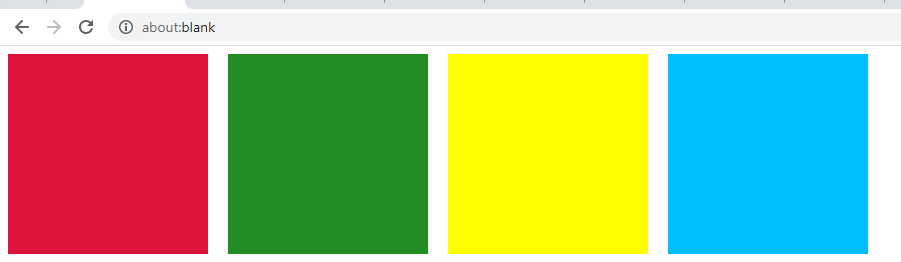
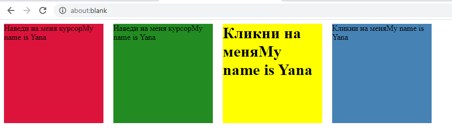

#Homework DOM 
###Required
***Создайте массив `tags` с именами валидных тегов HTML5***
>Теперь создайте массив `classes` с именами классов
>( число элементов в массиве `classes` должно быть не меньше, чем число элементов массива `tags` )
>Создайте элемент `style` и вставьте его в `head` документа
>Добавьте контент элемента `style` с описанием классов, имена которых находятся в массиве `classes`
>Итерируйте массив `tags`, создавая соответствующие элементы и вставляя их на страницу 
>добавляя каждому элементу класс из массива `classes`
---
```js
var tags = ['div', 'p', 'h1', 'div'];
var classes = ['mainBlock', 'mainText', 'mainHeader', 'lastBlock'];
var style = document.head.appendChild(document.createElement('style'));
style.textContent = `
.${classes[0]}{width:200px;height:200px;background:#DC143C;margin-right:20px;margin-top:0;}
.${classes[1]}{width:200px;height:200px;background:#228B22;margin-right:20px;margin-top:0;}
.${classes[2]}{width:200px;height:200px;background:#FFFF00;margin-right:20px;margin-top:0;}
.${classes[3]}{width:200px;height:200px;background:#00BFFF;margin-right:20px;margin-top:0;}
body{display:flex; justify-content:start;}
`
for(var elem of tags){
    var elemHtml = document.body.appendChild(document.createElement(elem));
    var nameOfClass = classes.shift();
    elemHtml.setAttribute('class', nameOfClass);
}
```

###Additional
***Результат должен быть аналогичен тому, что получится в предыдущем упражнении***
>Однако исходный массив `tags` должен быть массивом объектов, каждый из которых содержит не только
>имя тега элемента, но и его атрибуты, а так же хотя бы один обработчик события
>Таким образом, массив `classes` нам уже не нужен, но кроме стилизации элементов нужно еще добавить
>их контент, используя как атрибуты тегов, так и свойства элементов DOM
---
```js
var tags = [
        {
                name: 'div',
                attrs: { className:'mainBlock'},
                text: 'Hаведи на меня курсор'
        },
        {
                name: "p", 
                attrs: { className: 'mainText'},
                text: 'Hаведи на меня курсор'
        },
        {
                name: 'h1', 
                attrs: { className: 'mainHeader' },
                text: 'Кликни на меня'
        },
        {
                name: 'section', 
                attrs: { className: 'lastBlock' },
                text: 'Кликни на меня'
        }
]
var style = document.head.appendChild(document.createElement('style'));
style.textContent = `
.mainBlock{width:200px;height:200px;background:#DC143C;margin-right:20px;margin-top:0;}
.mainText{width:200px;height:200px;background:#228B22;margin-right:20px;margin-top:0;}
.mainHeader{width:200px;height:200px;background:#FFFF00;margin-right:20px;margin-top:0;}
.lastBlock{width:200px;height:200px;background:#00BFFF;margin-right:20px;margin-top:0;}
body{display:flex; justify-content:start;}
`
for(var elem of tags){
    var elemHtml = document.body.appendChild(document.createElement(elem.name));
    for(var attr in elem.attrs){
         elemHtml.setAttribute('class', elem.attrs[attr])
    }
    elemHtml.innerText = elem.text
    var text = document.createTextNode('My name is Yana');
    elemHtml.appendChild(text);
    elemHtml.id = `${elem.name}Elem`
}
var mainEven = document.getElementById('divElem');
mainEven.onmouseover = function(event) {
    event.target.style.background = 'red';
}
mainEven.onmouseout = function(event) {
    event.target.style.background = '#DC143C';
}
var pEvem = document.getElementById('pElem');
pEvem.onmouseenter = function(event) {
    event.target.style.background = '#00FF7F';
}
pEvem.onmouseleave = function(event) {
    event.target.style.background = '#228B22';
}
var h1Even = document.getElementById('h1Elem');
h1Even.onmouseenter = function(event) {
    event.target.style.background = '#FFD700';
}
h1Even.onmouseleave= function(event) {
    event.target.style.background = '#FFFF00';
}
var sectionEven = document.getElementById('sectionElem');
sectionEven.onmouseover = function(event) {
    event.target.style.background = '#4682B4';
}
sectionEven.onmouseout = function(event) {
    event.target.style.background = '#00BFFF';
}
```

###Additional
***Напилить код, который выбирает все элементы-потомки `body` (  кроме элементов `script` ) и добавляет им класc:***
```hTML
.redBack {background-color: red!important;}
```
>Запустить код в консоли любой страницы
>Подсказка: используйте методы объекта `classList`
---
```JS
var style = document.head.appendChild(document.createElement('style'));
style.textContent = `.redBack{background-color: red!important;}`
var collectionChildrenBody = document.body.children
for(var obj of collectionChildrenBody){
    if(obj.tagName === 'SCRIPT')continue
    obj.classList.add('redBack');
}
```
###Additional
***Напилить код, который выбирает все заранее заданные элементы:***
```js
var tags = [ "header", "footer", "main", "div", "p" ]
```
>и добавляет им класc:
```hTML
.redBack {background-color: red!important;}
```
>Запустить код в консоли любой страницы
>Подсказка: используйте методы объекта `classList`
---
```JS
var style = document.head.appendChild(document.createElement('style'));
style.textContent = `.redBack{background-color: red!important;}`
var tags = ['header', 'footer', 'main', 'div', 'p' ];
for(var elem of tags){
    var collection = document.getElementsByTagName(elem);
    for(var tag of collection){
        tag.classList.add('redBack');
    }
}